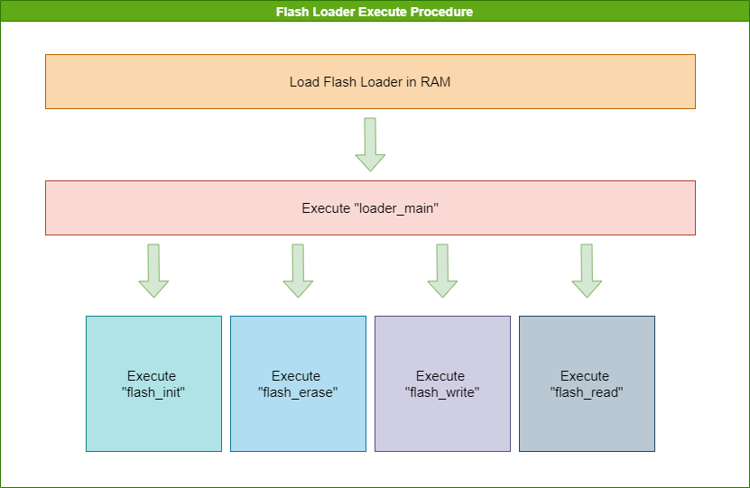

# Openocd-Flashloader

[](https://github.com/riscv-mcu/openflashloader/actions/workflows/build.yaml)

## Introduction

With the increasing number of customers, the standard OpenOCD can no longer met the market demand.

In order to enable customers to customize the flash driver and loader algorithm of OpenOCD without recompiling the OpenOCD tool,
OpenOCD flashLoader perfectly solves this problem.

Please refer to the following description for details.

## Directory Structure

The directory structure of openocd-flashloader.

```console
openocd-flashloader
├── flash                      // FLASH Drivers Directory
│   ├── flash.h                // FLASH Driver's API
│   ├── w25q256fv.c            // W25Q256FV Driver Source Code
├── img                        // Store README.md Needs image
│   ├── procedure.png          // Flash Loader Execute Procedure
├── loader                     // Flash Loader Directory
│   ├── loader.c               // Loader Source Code
│   ├── riscv.lds              // Loader Link Script
│   ├── startup.S              // Loader startup file
├── spi                        // SPI Driver Directory
│   ├── spi.h                  // SPI Driver's API
│   ├── nuspi.c                // Nuclei SPI Driver
│   ├── fespi.c                // Sifive SPI Driver
├── test                       // Loader Tests Directory
│   ├── main.c                 // Loader Self-test Code
├── .gitignore                 // Git Ignore File
├── Makefile                   // Main Makefile
├── Makefile.loader            // Loader Makefile
├── Makefile.sdk               // Tests Makefile
├── README.md                  // Readme
```

## Execute Procedure

Nuclei OpenOCD will load the flash loader binary which specified in openocd configuration file using ``flash bank name custom`` feature, see https://doc.nucleisys.com/nuclei_tools/openocd/intro.html#nuclei-customized-features

The flash loader(loader/loader.c) binary will ``loader_main`` with parameters passed in openocd custom flash driver, see https://github.com/riscv-mcu/riscv-openocd/blob/a383d1d034d87b6527e9e9ee8426973b7e0a12d0/src/flash/nor/custom.c#L111-L270

> Nuclei OpenOCD source code can be found in https://github.com/riscv-mcu/riscv-openocd/
>
> Nuclei OpenOCD documentation can be found in https://doc.nucleisys.com/nuclei_tools/openocd/intro.html



## Prerequisites

**The following environment must be setuped**

- **Nuclei Studio Version >= 2024.02**, which contains prebuilt gcc and openocd
- Don't use any global variables.(**Warning**)

### Flash Driver API

This section mainly describe the flash driver API you must implemented for your own flash driver.

If some argument is not suitable for you, you can ignore it or use it as your requirement.

eg. ``spi_base`` in this flash driver API maybe not suitable for the case which flash are not interfaced via
spi, but it is passed to this via openocd ``flash bank`` command, see https://doc.nucleisys.com/nuclei_tools/openocd/intro.html#nuclei-customized-features

#### flash_init

****

**Prototype**

```c
int flash_init(uint32_t *spi_base);
```

**Description**

Initialize nuspi, read flash ID and return the flash ID.

**Parameters**

* spi_base: SPI base address.

**Return values**

Flash ID（**Warning**）

#### flash_erase

****

**Prototype**

```c
int flash_erase(uint32_t *spi_base, uint32_t start_addr, uint32_t end_addr);
```

**Description**

Erases Flash space between **start_addr** and **end_addr**.

**Parameters**

* spi_base: SPI base address.
* start_addr: start addr of the flash to be erased.
* end_addr: end addr of the flash to be erased.

**Return values**

* 0: OK
* Other: ERROR

#### flash_write

****

**Prototype**

```c
int flash_write(uint32_t *spi_base, uint8_t* buffer, uint32_t offset, uint32_t count);
```

**Description**

Write the **count** data from **buffer** to flash's **offset**.

**Parameters**

* spi_base: SPI base address.
* buffer: source address.
* offset: flash offset.
* count:  number of bytes to be write.

**Return values**

* 0: OK
* Other: ERROR

#### flash_read

****

**Prototype**

```c
int flash_read(uint32_t *spi_base, uint8_t* buffer, uint32_t offset, uint32_t count);
```

**Description**

Read the **count** data from flash's **offset** to **buffer**.

**Parameters**

* spi_base: SPI base address.
* buffer: destination address.
* offset: flash offset.
* count: number of bytes to be read.

**Return values**

* 0: OK
* Other: ERROR

## How To Use

Implement your own flash driver to match above ``Flash driver API``, this flash loader is called via openocd
**custom** loader developed in https://github.com/riscv-mcu/riscv-openocd/blob/a383d1d034d87b6527e9e9ee8426973b7e0a12d0/src/flash/nor/custom.c#L111-L270.

- Flash driver reference: ``flash/w25q256fv.c``
- SPI driver reference maybe used by flash: ``spi/nuspi.c``

To compile this flashloader code, you need to install Nuclei RISC-V Toolchain or Nuclei Studio(preferred, which contains the toolchain in ``<Nuclei Studio>/toolchain/gcc``), see https://nucleisys.com/download.php#tools

You can directly setup environment **PATH** via command line before you build flashloader.

~~~shell
# Assume that you have downloaded Nuclei Studio latest version, currently 2024.02
# Please change NUCLEI_TOOL_ROOT to the real path of where your toolchain folder located in windows or linux

# Only execute commands below, if you are in windows cmd terminal
set NUCLEI_TOOL_ROOT=C:\NucleiStudio\toolchain
set PATH=%NUCLEI_TOOL_ROOT%\gcc\bin;%NUCLEI_TOOL_ROOT%\openocd\bin;%NUCLEI_TOOL_ROOT%\build-tools\bin;%NUCLEI_TOOL_ROOT%\qemu\bin;%PATH%

# Only execute commands below, if you are in linux bash terminal
NUCLEI_TOOL_ROOT=~/NucleiStudio/toolchain
export PATH=$NUCLEI_TOOL_ROOT/gcc/bin:$NUCLEI_TOOL_ROOT/openocd/bin:$NUCLEI_TOOL_ROOT/qemu/bin:$PATH
~~~

In this repo, we provide sample flash loader implementation code which can be directly used with our Nuclei Evaluation SoC(SPI=nuspi FLASH=w25q256fv),
which means you can check and verify it directly without any modification to see how it will work.

For Nuclei Evalation SoC doc, please contact with our support engineer to get it.

### Compile/Debug Self-Test

This self test code in ``test/main.c`` is mainly used to validate whether the loader implementation
is ok or not.

> You need to check **TODO** in this ``test/main.c``

Here we use [Nuclei SDK](https://github.com/Nuclei-Software/nuclei-sdk) as self-test code
executing environment, **if your board is not yet supported by Nuclei SDK**, you will not be
able to do this test, you will need to port this selftest code in `test/main.c` to your environment,
the required other source files see ``Makefile.sdk``

Here below are just some sample commands when you are using nuclei sdk to test and validate
your flash loader implementation.

```shell
## set NUCLEI_SDK_ROOT variable required by this self test code, see Makefile.sdk
set NUCLEI_SDK_ROOT=D:\Nuclei_Work\Git\nuclei-sdk

## SPI and FLASH make variable should be changed to match your real spi and flash driver name
## Here list some sample build command and debug command using gdb

## compile/debug self-test with rv32 spi:nuspi.c flash:w25q256fv.c
make ARCH=rv32 MODE=sdk SPI=nuspi FLASH=w25q256fv clean all
make ARCH=rv32 MODE=sdk SPI=nuspi FLASH=w25q256fv debug

## compile/debug self-test with rv64 spi:nuspi.c flash:w25q256fv.c
make ARCH=rv64 MODE=sdk SPI=nuspi FLASH=w25q256fv clean all
make ARCH=rv64 MODE=sdk SPI=nuspi FLASH=w25q256fv debug

## compile/debug self-test with rv32 spi:fespi.c flash:w25q256fv.c
make ARCH=rv32 MODE=sdk SPI=fespi FLASH=w25q256fv clean all
make ARCH=rv32 MODE=sdk SPI=fespi FLASH=w25q256fv debug

## compile/debug self-test with rv64 spi:fespi.c flash:w25q256fv.c
make ARCH=rv64 MODE=sdk SPI=fespi FLASH=w25q256fv clean all
make ARCH=rv64 MODE=sdk SPI=fespi FLASH=w25q256fv debug
```

> [!NOTE]
>
> <mark>The loader can only be compiled if self-test has passed.</mark>
>
> <mark>The **SPI** compile option is used to specify the spi driver source file without the suffix.</mark>
>
> <mark>The **FLASH** compile option is used to specify the flash driver source file without the suffix.</mark>

### Compile Flashloader

When your flash loader implementation is done and validated using your environment,
you can build this flashloader binary and use it with openocd.

```shell
# build loader spi:nuspi.c flash:w25q256fv.c
make ARCH=rv32 MODE=loader SPI=nuspi FLASH=w25q256fv clean all
make ARCH=rv64 MODE=loader SPI=nuspi FLASH=w25q256fv clean all

# build loader spi:fespi.c flash:w25q256fv.c
make ARCH=rv32 MODE=loader SPI=fespi FLASH=w25q256fv clean all
make ARCH=rv64 MODE=loader SPI=fespi FLASH=w25q256fv clean all
```

**Flashloader can be found** in ``build/rv32/loader.bin`` for ``ARCH=rv32``,
and ``build/rv64/loader.bin`` for ``ARCH=rv64``.

### Flash Bank Configuration

If your flashloader binary is validated and compiled successfully with above steps, now you can
use it with openocd now, you need to modify your openocd configuration file, sample configuration
file for Nuclei HBird Debugger to access to Nuclei Evaluation SoC, please see

- https://github.com/Nuclei-Software/nuclei-sdk/blob/develop/SoC/evalsoc/Board/nuclei_fpga_eval/openocd_evalsoc.cfg
- https://github.com/Nuclei-Software/nuclei-sdk/blob/develop/SoC/gd32vf103/Board/gd32vf103v_rvstar/openocd_gd32vf103.cfg

For Nuclei OpenOCD guide, see https://doc.nucleisys.com/nuclei_tools/openocd/intro.html

```shell
# openocd flash bank configure command(only parameters in parentheses can be modified)
# For detail flash bank explaination, see openocd/doc/pdf/openocd.pdf
flash bank $FLASHNAME custom <xip_base> 0 0 0 $TARGETNAME <spi_base> <loader_path> [simulation]

# openocd flash bank configure example
# Please change 0x20000000 - the spiflash xip address to the real address of your spiflash xip address
# please change 0x10014000 - the spi base to access the spiflash to the real spi base to access your spiflash or some other value required by you
# please change /path/to/loader.bin to the real path of your flash loader binary
flash bank $FLASHNAME custom 0x20000000 0 0 0 $TARGETNAME 0x10014000 /path/to/loader.bin
# while [simulation] exist, the loader's timeout=0xFFFFFFFF
flash bank $FLASHNAME custom 0x20000000 0 0 0 $TARGETNAME 0x10014000 /path/to/loader.bin simulation
```

If the configuration is modified, eg. call it ``openocd.cfg``, then you can use run following command to test it:

~~~shell
openocd -f /path/to/openocd.cfg
~~~

> [!NOTE]
>
> <mark> **custom** is the keyword and should not be changed with others.</mark>
>
> <mark>In the current command **custom** option can't be modified.</mark>
>
> <mark>**<loader_path>** option advised to write the full path,  because you maybe don't know where you are.</mark>

## Error Table

| Describe                 | Value     |
| ------------------------ | --------- |
| RETURN_OK                | 0x0       |
| RETURN_ERROR             | 0x1 << 31 |
| RETURN_FLASH_WIP_ERROR   | 0x1 << 0  |
| RETURN_FLASH_ERASE_ERROR | 0x1 << 1  |
| RETURN_FLASH_WRITE_ERROR | 0x1 << 2  |
| RETURN_FLASH_READ_ERROR  | 0x1 << 3  |
| RETURN_SPI_TX_ERROR      | 0x1 << 4  |
| RETURN_SPI_RX_ERROR      | 0x1 << 5  |
